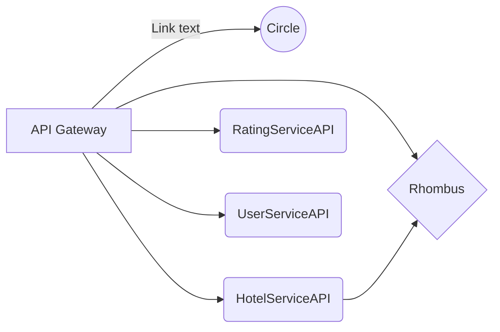

# UserServiceAPI
UserServiceAPI is a backend in SpringBoot Microservices

# Hi! I'm Amol and it is an Example of Microservices in Spring Boot 

For Running the Microservice application we need to start 3 Application at a same time so we can get the output as expected otherwise one of the services is down (it indicates).

1. **HotelServiceAPI** -->  [link](https://github.com/amolgadge663/HotelServiceAPI)
2.  **RatingServiceAPI** --> [link](https://github.com/amolgadge663/RatingServiceAPI)
3.  **UserServiceAPI** --> [link](https://github.com/amolgadge663/UserServiceAPI)

## UML diagrams

And this will produce a flow chart:

